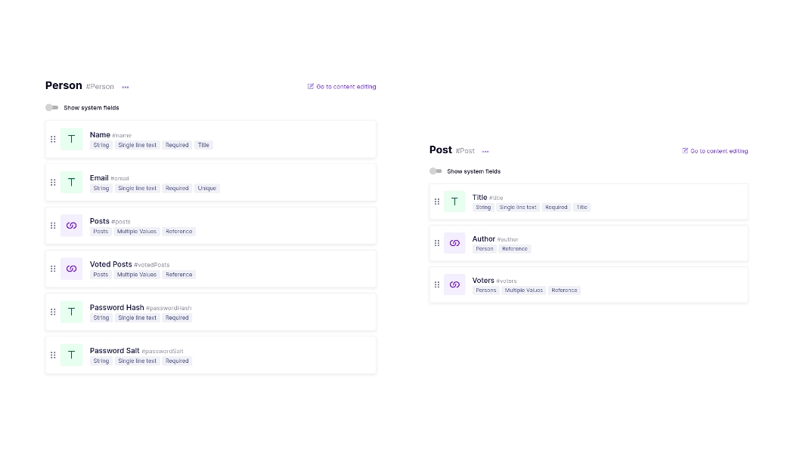

# TheCodeNinjas - Backend

## GraphQL Architecture
When having to choose between a locally hosted GraphQL implementation (neo4j-graphql-js library) and a Remote GraphQL API (headless GraphCMS API), we chose the headless variant as, firstly, it allowed us to work on a central database without the need of setting it up multiple times and having to invest effort and time into maintaining it.
We also chose it, as it was an interesting API and we wanted to learn how to work with it.


## Installation
The installation is divided into two parts. At first one has to setup the headless GraphCMS and secondly we provide information about setup in the local environment.

### Headless GraphCMS
In the following we describe each step necessary for the setup.
1. Signup at <a href="https://graphcms.com/">GraphCMS </a>
2. Create a new Database
<p align="center">
    
</p>
3. Generate the necessary fields according to your schema
<p align="center">
    
</p>


### Local-Setup

Once the remote database is set up, the local environment can be configured to communicate with it.
1. Clone this repository 

``` 
git clone https://github.com/Systems-Development-and-Frameworks/TheCodeNinjas.git
```

2. Go into the backend folder

```
cd TheCodeNinjas\backend
```

3. Install all the necessary npm packages

```
npm install
```

4. Create and configure a .env file

```
JWT_SECRET= <>
PORT = 4000
SALT_ROUNDS = <>
GRAPH_CMS_ENDPOINT = <>
GRAPH_CMS_API_TOKEN = <>
JWT_EXPIRES_IN = <>

```

5. Run the project

```
npm start
```
